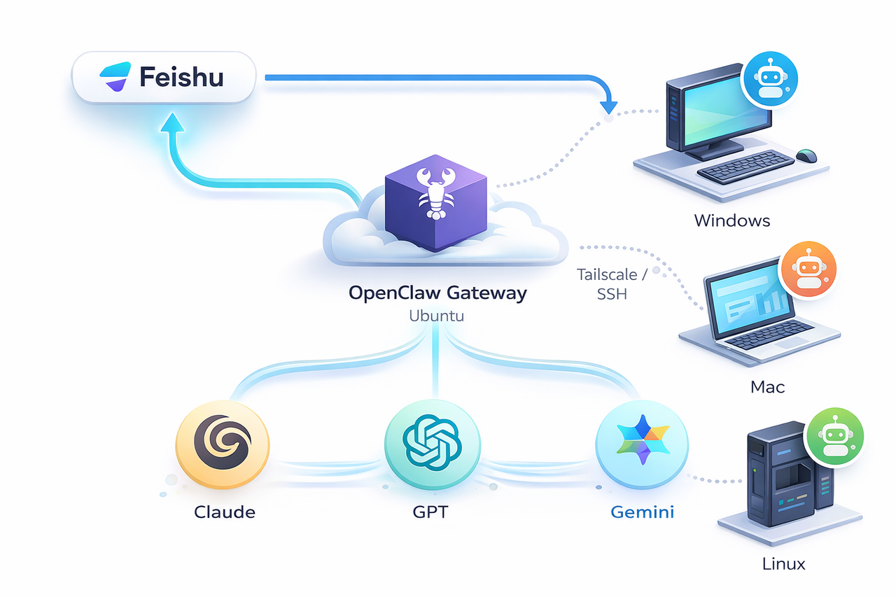

# openclaw-remote-desktop

构建一个 **通过飞书聊天控制本地电脑的 AI 自动化系统**。

默认情况下，OpenClaw 部署在某台宿主机上时，AI Agent 运行在受限的沙盒环境中，只能访问本机的工作区和系统资源，因此自动化能力通常局限于宿主机本身，无法直接控制其他设备。

本项目通过引入：

* **OpenClaw Node**
* **Tailscale 私有网络**
* **Windows 自动化桥接（desktopctl）**

将执行能力从单一主机扩展到多台设备。

Agent 仍然运行在沙盒环境中，但任务可以通过 **Node 协议**转发到远程节点执行，从而实现 **跨沙盒、跨设备的自动化控制能力**。

最终，AI 不再只控制部署 OpenClaw 的机器，而是可以通过统一的 **Gateway** 调度多台 Windows / Linux 设备，形成一个可扩展的 **多设备 AI 自动化控制网络**。

---

# Architecture

<p align="center">
  
</p>

系统架构：

```
Feishu
   │
   ▼
OpenClaw Gateway (Ubuntu)
   │
   │  Tailscale VPN
   ▼
Windows Node
   │
   ▼
desktopctl
   │
   ├─ 文件系统操作
   ├─ 应用控制
   ├─ 鼠标键盘自动化
   └─ 截图 / 桌面操作
```

---

# Documentation

详细部署步骤见：

```
docs/多设备 AI 自动化控制网络.pdf
```

需要说明的是：

> 本仓库 **不重点介绍 OpenClaw 的基础安装过程**，而是主要关注
> **多台设备共用一个 OpenClaw Gateway 的实现方式**，以及在此基础上的跨设备自动化控制方案。

如果你尚未安装 OpenClaw，请先参考官方文档。

⚠️ 同时需要注意 **LLM API 调用额度限制**。

---

# Security Notice

本仓库中的配置文件仅作为 **模板示例**。

在运行系统之前，你需要替换以下字段：

* `Feishu App ID`
* `Feishu App Secret`
* `Feishu Encrypt Key`
* `Gateway Token`

---

# Repository Structure

```
openclaw-remote-desktop
│
├── README.md
├── docs
│   └── 多设备 AI 自动化控制网络.pdf
│
├── image
│   └── system.png
│
└── desktopctl
```

---

# Future Work

* 更完善的 Windows 自动化能力
* UI Automation / OCR 自动化
* 多节点自动调度
* 更安全的权限控制策略

---


